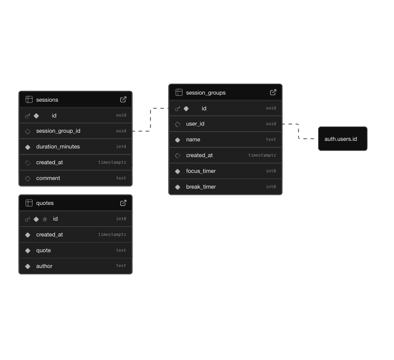

# AvocadoroMobile

**AvocadoroMobile** is a Pomodoro-style productivity app built with **ReactNative**, **TypeScript** and **Supabase**.  
It helps you focus on your study or learning sessions, track breaks, and visualize your progress over time.<br>
It's a mobile version of [**Avocadoro**](https://github.com/koleks92/Avocadoro)

## Get started

1. Install dependencies

    ```
    npm install
    ```

2. Start the app

    ```
    npx expo start
    ```

---
⚠️ IMPORTANT
Ensure you have a Supabase project set up (Database and Auth) and add the following environment variables to your .env.local file using this schema:

```
EXPO_PUBLIC_SUPABASE_URL=
EXPO_PUBLIC_SUPABASE_PUBLISHABLE_KEY=
EXPO_PUBLIC_WEBCLIENT_ID=
EXPO_PUBLIC_IOSCLIENT_ID=
```

SQL project schema:




## Development build EAS Local

- Android
  `eas build --platform android --profile development --local`
- iOS
  `eas build --platform ios --profile development --local`

## Testing

### Maestro testing

1. To test install `maestro`
2. Start the app
    ```
    npx expo start
    ```
3. Make sure that simulator or real device is connected
4. Run any of the tests inside folder `.maestro` fx.
    ```
    maestro test .maestro/index/signin-screen.yml
    ```

If `java runtime error` occurs, run in your terminal

```
kill -9 $(lsof -t -i tcp:7001)
```

### Jest testing

1. To test run
    ```
    npm run test
    ```
